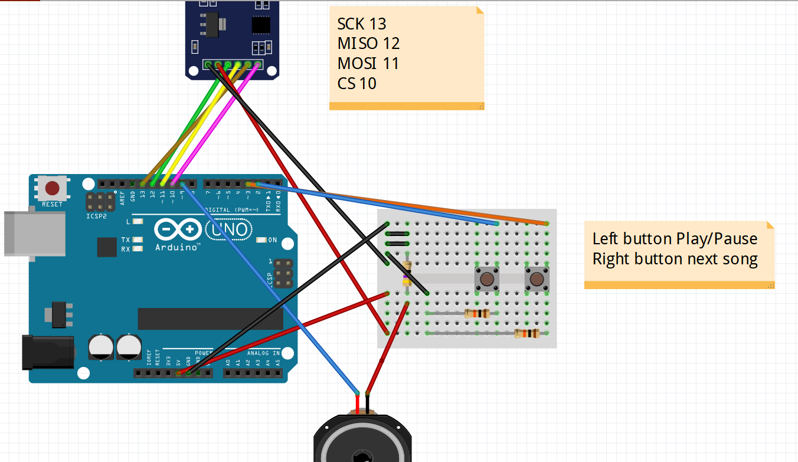

# JR Train Melody Music Player

A simple Arduino-based music player for Japanese Railway train melodies and station jingles. This project allows you to play AHM, WAV, and MP3 audio files from an SD card with basic playback controls.

## Features

- Plays audio files (AHM, WAV, MP3) from SD card
- Pause/Play functionality with button control
- Skip to next track with button control
- Auto-plays next track when current one finishes
- Dynamic file loading system (loads new files after playing through current set)
- Works with a variety of audio formats common to train station melodies

https://github.com/user-attachments/assets/fb6402e9-6241-4a65-a071-f989425eb86b

## Hardware Requirements

- Arduino board (Uno or similar)
- SD card module (with CS pin connected to Arduino pin 10)
- Audio amplifier circuit (LM386 or similar)
- Speaker or headphone output
- 2 push buttons for control (connected to pins 2 and 3)
- Power supply appropriate for your setup

## Wiring Diagram

## Software Dependencies

- SimpleSDAudio Library
- SD Card Library (standard Arduino library)

## Installation

1. Install the required libraries in Arduino IDE:
   - Copy the SimpleSDAudio library to your Arduino libraries folder
2. Connect the hardware components according to the wiring diagram
3. Format your SD card to FAT16 or FAT32
4. Copy your AHM/WAV/MP3 files to the root directory of the SD card
5. Upload the sketch to your Arduino board:
   - Open the `playwawTestDynamic.ino` file in Arduino IDE
   - Select your board and port
   - Click Upload

## Audio File Conversion

For optimal compatibility, you may need to convert your audio files:

1. Install SoX audio processing tools on your computer
2. Use the included batch script (`sox-14-4-2/batch-example.bat`) as a template for converting files
3. Typically, files should be converted to:
   - 8-bit or 16-bit depth
   - Mono channel
   - 8-44.1kHz sample rate (depending on your hardware capabilities)

## Usage

1. Power on the device
2. The player will automatically start playing files from the SD card
3. Use the buttons to control playback:
   - Press the Pause button (pin 2) to pause/resume playback
   - Press the Next button (pin 3) to skip to the next track
4. The player will automatically proceed to the next track when the current one finishes

## Adjustable Settings

You can modify these parameters in the `playwawTestDynamic.ino` file:
- Pin assignments for buttons and SD card
- Playback behavior
- File loading patterns
- Audio quality settings

## Available Sketches

- **playwawTestDynamic.ino**: Recommended sketch with dynamic file loading capability
- **playwawTest.ino**: Basic version without dynamic file loading

## Troubleshooting

- **No sound**: Check your amplifier circuit and connections
- **SD card not detected**: Ensure proper formatting (FAT16/FAT32) and connections
- **Files not playing**: Verify file formats are compatible (use SoX to convert if needed)
- **Playback issues**: Try different audio settings or file conversion parameters

## About JR Train Melodies

JR (Japan Railways) train stations are known for their unique departure melodies and announcement jingles. These melodies, which play before train departures or arrivals, have become iconic elements of Japanese rail travel and are popular among train enthusiasts worldwide.

## License

This project is provided as open-source software. Please respect all third-party library licenses.

## Acknowledgements

- SimpleSDAudio Library
- SoX audio processing tools for file conversion
